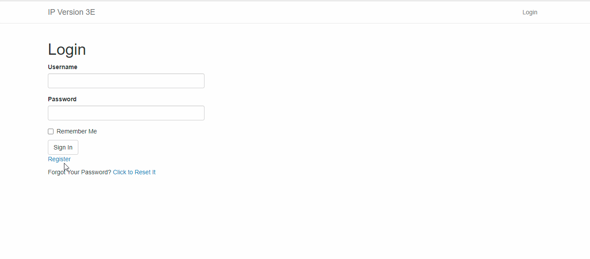
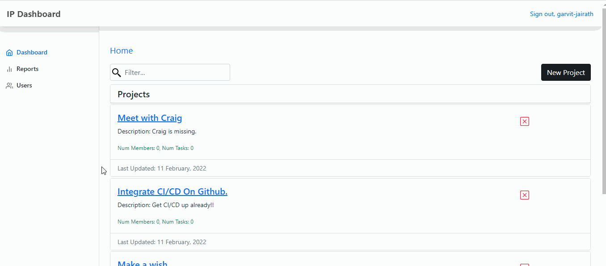
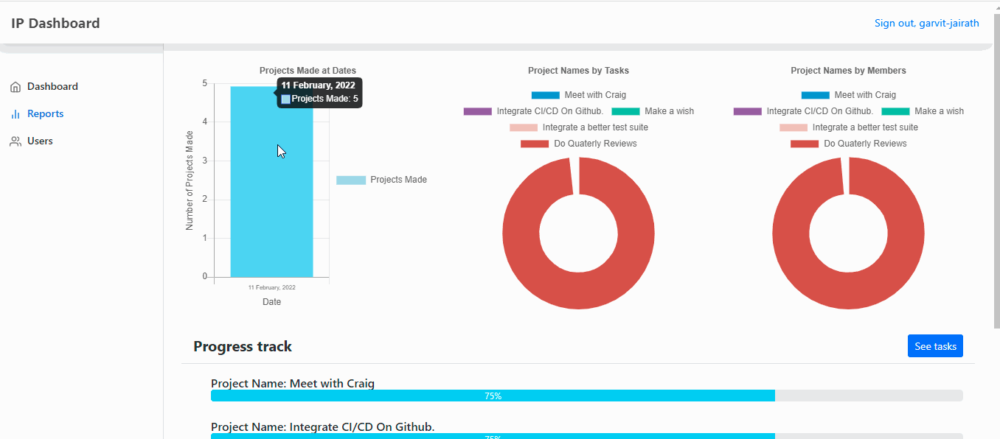
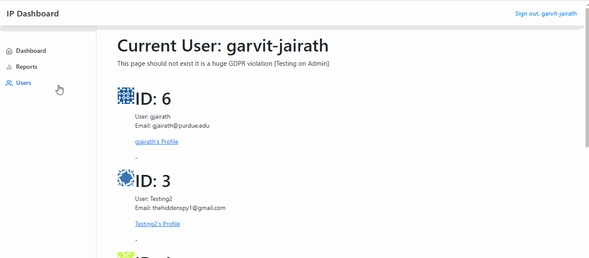

# IP - Version 2.0 
A project management tool that isn't as saturated as the ones you see today. 

# Description
A project management tool that I wanted to call "Tuesday.com" but chose not to do so for obvious reasons. IP stands for intelligent planner.

# Link
https://creativitynotfound.herokuapp.com/

# View

   
   

   
   

   
   

   

# Deployment
$ git add .  
$ git commit -am "make it better"  
$ git push heroku master  

